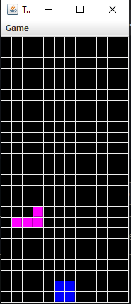
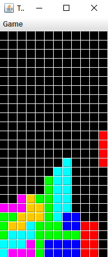
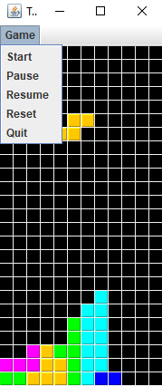

# tetris-clone
Mi primer proyecto en OOP, allá en 2011

Un clon del Tetris con las funcionalidades básicas del juego original

<dl>
<dt><b>Version:</b></dt>
  <dd>17.05.2011</dd>
<dt><b>Author:</b></dt>
  <dd>Octavio Martinez</dd>
</dl>

El funcionamiento general de la aplicación se basa en el uso de una matriz de
dos dimensiones, de 25 filas por 12 columnas, la cual almacena en cada una de
sus celdas los bloques que forman cada una de las posibles piezas del juego o
tetriminos.

El funcionamiento básico de juego es el siguiente:

<ul>
<li>Inicialmente se crea un nuevo objeto de la clase Tetris, la cual cuando se
llama a su constructor, crea dos nuevos objetos de tipo Grid y GameView,
así como los oyentes de eventos necesarios tanto para el teclado como para
los menús de juego. Seguidamente se pinta en pantalla la matriz de juego,
se crea un nuevo tetrimino aleatorio en la posición inicial y se da comienzo
al juego por medio del temporizador.</li>

<li>Una vez iniciado el juego, para realizar cualquier movimiento de las piezas,
ya sea por creación de una nueva pieza, desplazamiento descendente (natural o inducido), desplazamientos laterales o giros, se invoca el método correspondiente de Grid que realiza el movimiento adecuado pintando nuevos
bloques en las posiciones correspondientes y borrando los antiguos. Una
vez que se realiza el movimiento mediante la llamada a los métodos de
Grid, el método invocador de Tetris llama a continuación al método principal de GameView (showStatus(grid)) para pintar el estado actualizado
de la matriz después del movimiento de las piezas.</li>

<li>Durante el “ciclo” del Timer se realiza a cada paso (cada 1000 ms por
defecto), aparte del movimiento descendente, una comprobación de la existencia de filas completas (llenas de bloques) para hacer lo que se conoce
como “linea”, que se trata de eliminar la fila completa (poniendo todas sus
celdas a null) y bajar una fila el resto de bloques apilados que existan en
la matriz en ese momento.</li>

<li>Aparte de lo anterior, se realiza a cada paso del juego (en cada acción del
Timer) una comprobación de que no hayamos alcanzado el tope superior
de la matriz, para que el juego pueda continuar. En caso contrario se
detiene el Timer y se muestra un mensaje de “Game Over”, dándose por
finalizado el juego.</li>
</ul>

